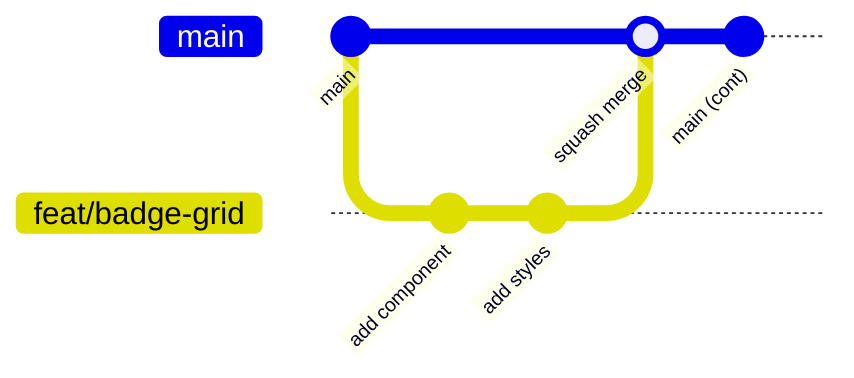

# Contributing

## Getting Started

```bash
nvm use
npm install
gulp trust-dev-cert   # one-time: trust the local HTTPS cert
gulp serve
```

> [!TIP]
> See the [README](README.md#quick-start) for a detailed local setup walkthrough.

## Branch Strategy



| Branch | Purpose |
|--------|---------|
| `main` | Production  - always deployable |
| `feat/*` | New features |
| `fix/*` | Bug fixes |
| `chore/*` | Tooling, deps, config |

All work happens on feature branches and merges to `main` via pull request.

## Commits

[Conventional commits](https://www.conventionalcommits.org/) format:

```
type(scope): short description
```

**Types:** `feat` · `fix` · `chore` · `ci` · `docs` · `style` · `refactor` · `test`

**Examples:**
```
feat(badge-grid): add locked badge card component
fix(responsive): adjust badge grid for teams sidebar
chore(deps): update pnpjs to 4.19.0
```

## Pull Request Process

1. Branch from `main`
2. Make small, focused commits
3. Verify locally:
   ```bash
   npx biome check .
   gulp bundle --ship
   ```
4. Open a PR using the [template](.github/PULL_REQUEST_TEMPLATE.md)
5. Request review from [CODEOWNERS](.github/CODEOWNERS)
6. Squash merge after approval

## Code Review Checklist

- [ ] No `any` types without justification
- [ ] No secrets or hardcoded URLs
- [ ] No external CDN dependencies
- [ ] Accessible  - keyboard nav, alt text, contrast ratios
- [ ] Responsive at 320px, 375px, 800px, 1200px+
- [ ] `npx biome check .` passes with zero errors

## Code Style

Biome handles formatting and linting. Key settings:

| Setting | Value |
|---------|-------|
| Indent | 4 spaces |
| Quotes | Single |
| Line width | 120 |
| Trailing commas | All |

Run `npx biome check --write src/` to auto-fix before committing.
