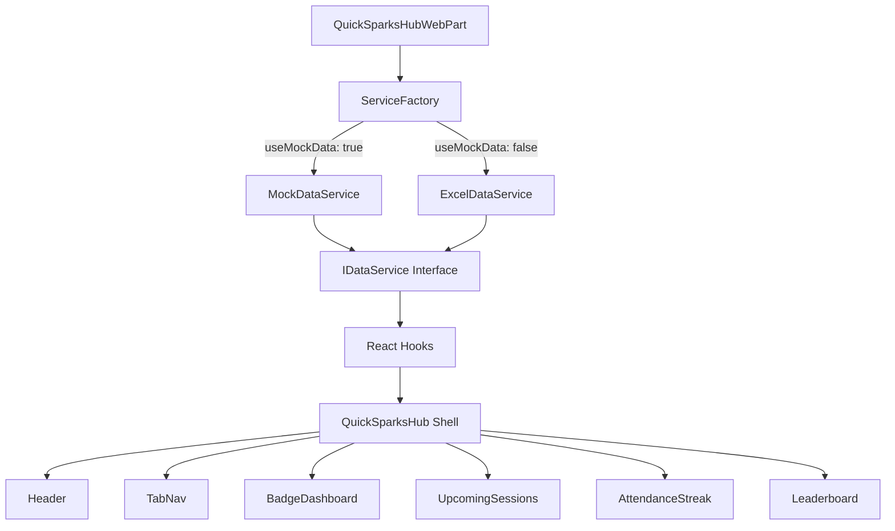
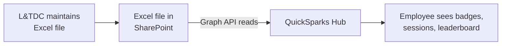

# QuickSparks Hub

A central home for employee learning badges at Republic Bank.

## The Problem

Employees attend QuickSparks workshops on Microsoft Teams and receive a badge via email afterwards  - but that's where the experience ends. Badges sit in individual inboxes. There's no way to see how many you've earned, which ones you're missing, or how your participation compares to peers.

## The Solution

A lightweight platform built entirely on the M365 stack Republic Bank already licenses  - no new infrastructure, no new vendors, no additional cost. Accessible two ways:

- **Teams personal app**  - pinned to every employee's sidebar, bank-wide
- **RepublicConnect page**  - for those who prefer the intranet

## Features

| Feature | Description |
|---------|-------------|
| **Badge Dashboard** | Visual grid of every badge earned (with date) and locked (so you see what's available), searchable and filterable by series |
| **Upcoming Sessions** | Scheduled QuickSparks sessions pulled from the existing SharePoint calendar L&TDC maintains |
| **Attendance Streak** | Consecutive session attendance counter with animated count-up, encouraging regular participation |
| **Division Leaderboard** | Participation rates across divisions and branches, creating organic peer motivation |

## Architecture



> [!TIP]
> See [docs/architecture.md](docs/architecture.md) for detailed diagrams covering the component tree, data flow, and service layer.

## Tech Stack

| Layer | Technology |
|-------|-----------|
| Framework | SPFx 1.20 |
| UI | React 17, Fluent UI 8 |
| Language | TypeScript 4.7 (strict mode) |
| Data | Microsoft Graph API (Excel workbook endpoint) |
| Styling | SCSS Modules + CSS Custom Properties |
| Linting | Biome 2.x |
| CI/CD | GitHub Actions |

## Quick Start

### Prerequisites

| Requirement | Version | Check |
|-------------|---------|-------|
| Node.js | 18.x LTS | `node -v` |
| npm | 9.x+ | `npm -v` |
| Gulp CLI | 4.x | `gulp -v` |

> [!NOTE]
> An `.nvmrc` is included  - run `nvm use` to switch to the correct Node version.

### Setup

```bash
# 1. switch to node 18
nvm use

# 2. install dependencies
npm install

# 3. trust the spfx dev certificate (one-time)
#    this installs a self-signed cert so the local https server works
gulp trust-dev-cert

# 4. start the local dev server
gulp serve
```

This opens the SharePoint Workbench at `https://localhost:4321` with mock data loaded by default.

> [!IMPORTANT]
> You **must** run `gulp trust-dev-cert` before your first `gulp serve`. Without it, the browser will block the local HTTPS connection and the workbench won't load the web part.

### Connecting to Real Data

1. Open the web part property pane (edit icon)
2. Toggle **"Use mock data"** to **Off**
3. Fill in the **Excel File Location** fields:
   - **SharePoint site URL** - the site where the Excel file lives
   - **Document library name** - the library containing the file
   - **Excel file name** - the exact file name including extension

> [!WARNING]
> Real data mode requires the `Files.Read.All` Graph API permission to be approved and the Excel file to be in a SharePoint document library. See [docs/deployment.md](docs/deployment.md).

### Build for Production

```bash
gulp bundle --ship
gulp package-solution --ship
```

Output: `sharepoint/solution/quicksparks-hub.sppkg`

### Lint & Format

```bash
npx biome check src/        # check
npx biome check --write src/ # auto-fix
```

## Project Structure

<details>
<summary>Click to expand</summary>

```
src/webparts/quickSparksHub/
├── components/
│   ├── QuickSparksHub.tsx              # root app shell
│   ├── BadgeDashboard/                 # badge grid + search + filter
│   │   └── BadgeCard/                  # individual badge (earned/locked)
│   ├── UpcomingSessions/               # session card list
│   │   └── SessionCard/               # individual session
│   ├── AttendanceStreak/               # animated streak counter
│   ├── Leaderboard/                    # division rankings
│   │   └── LeaderboardRow/            # individual division row
│   └── common/                         # header, tab nav, skeleton, empty state, error boundary
├── services/
│   ├── IDataService.ts                 # service contract
│   ├── MockDataService.ts             # dev/demo data
│   ├── ExcelDataService.ts           # reads Excel via Graph API
│   ├── GraphClientHelper.ts          # Graph API file resolution
│   ├── DataCache.ts                  # in-memory cache with TTL
│   └── ServiceFactory.ts             # routes mock ↔ real
├── models/                             # ISession, IAttendance, IEmployee, ILeaderboardEntry, IUserBadge
├── hooks/                              # useBadges, useSessions, useStreak, useLeaderboard
├── config/
│   ├── theme.ts                        # design tokens
│   ├── excelConfig.ts                 # Excel column mappings + file config
│   └── spFieldNames.ts               # SharePoint column mappings (legacy)
├── utils/                              # dateUtils, badgeUtils, constants
└── assets/
    ├── badges/                         # badge images (PNG)
    └── PlaceholderBadge.tsx           # SVG placeholder
```

</details>

## Session Series

Sessions belong to one of 12 Skills Studios used for badge grouping and filtering:

<details>
<summary>Click to expand all 12 studios</summary>

| Skills Studio | Example Sessions |
|--------------|-----------------|
| 1.0 The Conversation Catalyst | Say It So It Sticks, Beyond Words, Active Listening Mastery |
| 2.0 Mind Over Maybes | The Power of Pause, Frame It Right |
| 3.0 Outside In | Why Mindset Matters, Diagnosing the Drama, Turning My Job Outward |
| 4.0 From Numbers to Narrative | Liquidity Matters |
| 5.0 Byte-Sized Brilliance | Team Up With Teams, Excel-lence Unlocked |
| 7.0 Think Risk, Act Right | Simplifying Compliance |
| 8.0 Dollars Making Sense? | Taking Charge of Your Money |
| 9.0 The Leader's Code | Unlocking Potential: The Heart of Coaching |
| 10.0 Imagine That! | Solve, Create, Innovate |
| 11.0 Courtesy Counts | Welcoming and Entertaining Guests/Clients |
| 12.0 Everyday Wins | Car Basics & Maintenance |

</details>

## How It Works



Data never leaves the M365 tenant. Authentication is automatic via Azure AD - employees are recognised the moment they open Teams. L&TDC maintains their existing Excel training tracker - the web part reads it directly via the Graph API. No data is copied, moved, or written.

## Documentation

| Document | Description |
|----------|-------------|
| [Architecture](docs/architecture.md) | Component tree, data flow, service layer, theming |
| [Deployment](docs/deployment.md) | .sppkg deployment, Excel file setup, Teams publishing |
| [Security Model](docs/security-model.md) | Authentication, permissions, CSP, dependency security |
| [Data Format](docs/data-format.md) | Excel structure guide for L&TDC (column rules, template) |
| [Security Policy](SECURITY.md) | Reporting vulnerabilities |
| [Contributing](CONTRIBUTING.md) | Branch strategy, commits, PR process |
