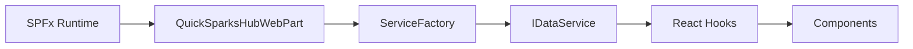
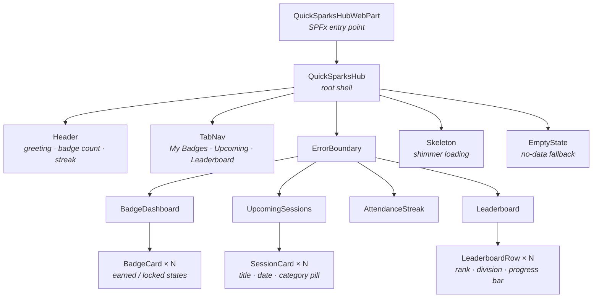
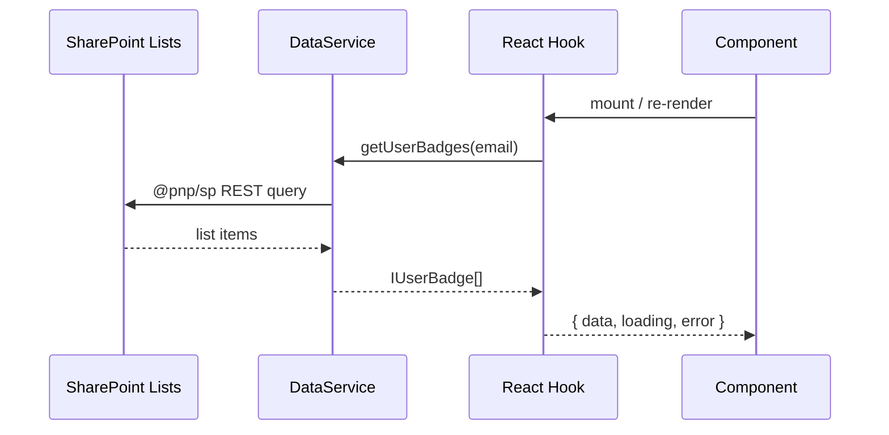
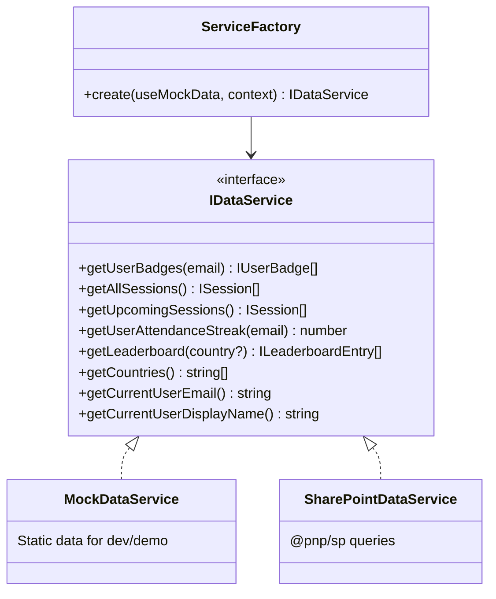
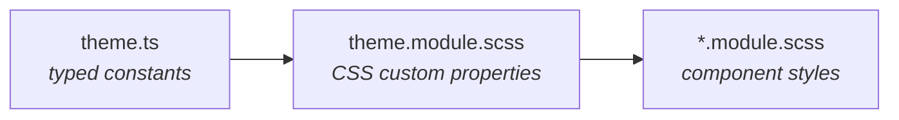

# Architecture

## Overview

QuickSparks Hub is a single SPFx web part that renders a React application. It follows a layered architecture: the SPFx runtime bootstraps a service layer, which feeds data through React hooks into presentational components.

> [!NOTE]
> Components never fetch data directly. They receive typed props from hooks, which call the service. This makes every component testable with plain props.

## Component Tree

## Data Flow

### Service Abstraction

The `IDataService` interface defines the contract. Two implementations exist:

`ServiceFactory` selects the implementation based on the `useMockData` web part property (toggle in the property pane).

> [!TIP]
> SharePoint column names are isolated in [`config/spFieldNames.ts`](../src/webparts/quickSparksHub/config/spFieldNames.ts). Changing a column name is a one-line edit  - no component or hook changes needed.

## Hooks

Each data concern has a dedicated hook that manages `loading`, `error`, and `data` state:

| Hook | Service Method | Returns |
|------|---------------|---------|
| `useBadges` | `getUserBadges()` | `IUserBadge[]` |
| `useSessions` | `getUpcomingSessions()` | `ISession[]` |
| `useStreak` | `getUserAttendanceStreak()` | `number` |
| `useLeaderboard` | `getLeaderboard()` | `ILeaderboardEntry[]` |

## Theming

Design tokens are defined in [`config/theme.ts`](../src/webparts/quickSparksHub/config/theme.ts) and mapped to CSS custom properties in `theme.module.scss`:

**Responsive breakpoints:** 320px · 375px (Teams sidebar) · 800px · 1200px+

## Key Design Decisions

| Decision | Rationale |
|----------|-----------|
| Class-based root component | SPFx property pane integration requires class component lifecycle |
| Functional child components + hooks | Simpler state management, easier testing |
| CSS Modules over CSS-in-JS | SPFx native support, zero runtime cost |
| PnPjs over raw REST | Type-safe queries, batching, caching built in |
| No external CDNs | Bank CSP blocks external resources; everything bundled in .sppkg |
| Minimal dependencies | Only PnPjs at runtime  - reduces supply chain risk |
