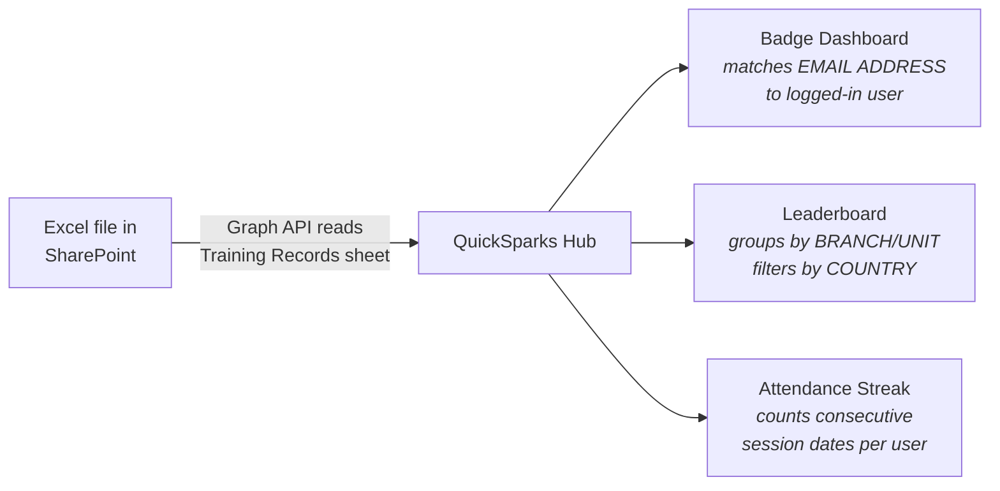

# Data Format Guide

QuickSparks Hub reads directly from an Excel file stored in SharePoint. This document describes the expected format so L&TDC can maintain the file without breaking the app.

> [!CAUTION]
> **Do not** rename columns, move columns, or rename sheets. The app matches on exact column names and sheet names. Changing them will break the dashboard.

## Template

A ready-to-use template with the correct structure and sample data is available at [`docs/QuickSparks_Training_Tracker_Template.xlsx`](QuickSparks_Training_Tracker_Template.xlsx). The template also includes a **README** sheet with these same rules embedded in the file.

## Required Sheets

### Training Records (required)

This is the primary data sheet. The app reads **only** this sheet. Each row represents one employee's attendance at one session.

> [!IMPORTANT]
> - Headers must be on **row 3** (rows 1-2 are title/spacer)
> - Freeze panes at row 4 is recommended for usability

#### Columns

| Column | Required | Format | Example |
|--------|----------|--------|---------|
| CATEGORY OF TRAINING | Yes | Text - must match Data Source sheet | `Business Skills` |
| DATE OF TRAINING | Yes | Date (YYYY-MM-DD) | `2026-01-13` |
| SKILLS STUDIO | Yes | Text - must match Data Source sheet | `1.0 The Conversation Catalyst` |
| TRAINING CODE | Yes | Decimal: studio.session | `1.1`, `3.4`, `12.1` |
| SESSION NAME | Yes | Text (ALL CAPS by convention) | `LIQUIDITY MATTERS` |
| EMPLOYEE NUMBER | Yes | Numeric employee ID | `10001` |
| FIRST NAME | Yes | Text | `Aidan` |
| LAST NAME | Yes | Text | `Traboulay` |
| EMAIL ADDRESS | Yes | @rfhl.com email (must match Teams login) | `aidan.traboulay@rfhl.com` |
| BRANCH/UNIT | Yes | Text - employee's branch or department | `Park St-Sales` |
| COUNTRY | Yes | Country code from Data Source sheet | `RBL` |
| BRONZE | Conditional | `10` if 10-15 min attendance, blank otherwise | `10` or blank |
| SILVER | Conditional | `20` if 15-20 min attendance, blank otherwise | `20` or blank |
| GOLD | Conditional | `30` if >20 min attendance, blank otherwise | `30` or blank |

### Data Source (recommended)

Lookup values for dropdowns and validation. Not read by the app directly, but keeps the Training Records data consistent.

| Column | Purpose |
|--------|---------|
| CATEGORY | Valid training categories |
| LTDC COORDINATOR | Coordinator names (for L&TDC internal use) |
| SKILLS STUDIO | Valid skills studio names with numbering |
| COUNTRY | Valid country codes |

## Badge Tier Rules

Each attendance row should have **at most one** of BRONZE, SILVER, or GOLD filled in:

```
> 20 minutes  ->  GOLD column = 30   (30 points)
15-20 minutes ->  SILVER column = 20  (20 points)
10-15 minutes ->  BRONZE column = 10  (10 points)
< 10 minutes  ->  all blank           (no badge)
```

> [!NOTE]
> If none of the three columns are filled, the employee receives no badge for that session and won't appear in the dashboard for it.

## What You Can Safely Change

| Action | Safe? |
|--------|-------|
| Add new data rows below existing data | Yes |
| Edit values in existing rows | Yes |
| Add new sessions with new training codes | Yes |
| Add new categories/studios in Data Source | Yes |
| Add new sheets (for your own reporting) | Yes |
| Sort or filter the data | Yes |
| **Rename a column header** | **No - breaks the app** |
| **Move a column to a different position** | **No - breaks the app** |
| **Rename the "Training Records" sheet** | **No - breaks the app** |
| **Move headers to a different row** | **No - breaks the app** |
| **Delete columns** | **No - breaks the app** |

## Adding a New Session

1. Pick the Skills Studio from the Data Source sheet (or add a new one)
2. Assign a training code: studio number + next sequence (e.g. if last was `3.5`, use `3.6`)
3. Add one row per employee who attended
4. Fill in the badge tier column based on attendance duration
5. Save the file - the app picks up changes automatically (within 5 minutes)

## How the App Uses This Data



> [!TIP]
> The app caches data for 5 minutes. After updating the Excel file, changes appear in the dashboard within 5 minutes without any action needed.
