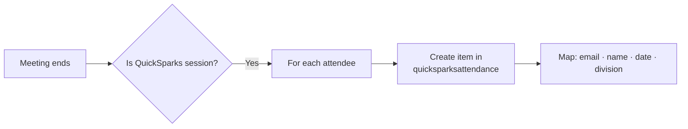

# Deployment

Step-by-step guide for deploying QuickSparks Hub to SharePoint Online and Microsoft Teams.

## Prerequisites

- SharePoint Admin access
- Teams Admin access
- Access to the App Catalog (`/sites/appcatalog`)

## 1. Provision SharePoint Lists

Create these two lists on the target site (e.g. `republicconnect`).

### `quicksparkssessions`

| Column | Type | Notes |
|--------|------|-------|
| Title | Single line of text | Session name (built-in) |
| SessionDate | Date and time | When the session was/will be held |
| Description | Multiple lines of text | Plain text only |
| BadgeImageUrl | Single line of text | URL to badge image in a document library |
| Category | Choice | See [session series](../README.md#session-series) |

### `quicksparksattendance`

| Column | Type | Notes |
|--------|------|-------|
| Title | Single line of text | Auto-generated or blank |
| SessionId | Lookup | Lookup → `quicksparkssessions` Title |
| EmployeeEmail | Single line of text | Must match Azure AD UPN |
| EmployeeName | Single line of text | Display name |
| AttendedDate | Date and time | Date of attendance |
| Division | Single line of text | Employee's division/branch |

> [!NOTE]
> Column names are mapped in [`config/spFieldNames.ts`](../src/webparts/quickSparksHub/config/spFieldNames.ts). If your list schema differs, update that file  - no code changes needed elsewhere.

## 2. Migrate Excel Data

L&TDC's attendance spreadsheet needs to be imported into the lists above.

<b>Option A:</b> Manual import (small dataset)

1. Open `quicksparkssessions` → **Add items from CSV** or create manually
2. Export the attendance Excel sheet to CSV (match the list schema)
3. Open `quicksparksattendance` → **Add items from CSV**

<b>Option B:</b> Power Automate (recommended)

1. Create a flow: **Manually trigger a flow**
2. **List rows present in a table** → point to the Excel file
3. **For each** row → **Create item** in the target list
4. Map Excel columns to list columns
5. Run once to migrate historical data

## 3. Upload Badge Images

1. Create a document library (e.g. `QuickSparksBadges`)
2. Upload all badge PNGs
3. Copy each image URL
4. Set the `BadgeImageUrl` column in `quicksparkssessions`

## 4. Deploy the .sppkg

1. Download the latest `.sppkg` from [GitHub Releases](../../releases)
2. Go to the App Catalog (`/sites/appcatalog/_layouts/15/tenantAppCatalog.aspx`)
3. Upload the `.sppkg`
4. In the dialog:
   - Check **"Make this solution available to all sites in the organization"**
   - Click **Deploy**

## 5. Approve API Permissions

Go to **SharePoint Admin Center → Advanced → API Access** (`/_admin/ServicePrincipal`).

Approve these pending requests:

| Permission | Purpose |
|-----------|---------|
| `Sites.Read.All` | Read session and attendance list data |
| `User.Read` | Current user identity (name, email) |

> [!CAUTION]
> The web part will show "Access Denied" errors until these permissions are approved.

## 6. Add to a SharePoint Page

1. Navigate to the target page on RepublicConnect
2. **Edit** the page
3. Add the **QuickSparks Hub** web part
4. In the property pane, set **"Use mock data"** to **Off**
5. **Publish** the page

## 7. Publish to Microsoft Teams

**Option A:** In the App Catalog, select the app → **Sync to Teams**

**Option B:**
1. Teams Admin Center → **Manage apps**
2. Upload the Teams app package (included in the .sppkg)
3. Pin the app via Teams App Setup Policy for target users

## 8. Configure Power Automate (Ongoing Attendance)

Set up a flow to capture Teams meeting attendance automatically:

1. **Trigger:** When a meeting ends (Teams connector)
2. **Filter:** Only QuickSparks sessions (by organizer or title pattern)
3. **Action:** For each attendee → Create item in `quicksparksattendance`
4. **Map:** attendee email, name, meeting date, division (from Azure AD profile)

## Troubleshooting

| Issue | Resolution |
|-------|-----------|
| Web part not in toolbox | Verify .sppkg is deployed tenant-wide; refresh the page |
| "Access Denied" errors | Approve API permissions in Admin Center (step 5) |
| No data showing | Check list names match `spFieldNames.ts`; toggle mock data off |
| Badge images broken | Verify URLs are accessible SharePoint document library links |
| Build fails locally | Run `nvm use` to ensure Node 18; delete `node_modules` and reinstall |
