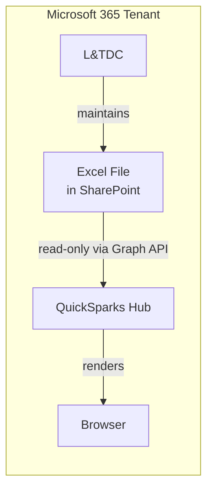

# Security Model

Technical overview of how QuickSparks Hub is secured. For reporting vulnerabilities, see [SECURITY.md](../SECURITY.md).

## Architecture

QuickSparks Hub is a **read-only** web part. It reads L&TDC's training tracker Excel file from a SharePoint document library via the Microsoft Graph API. It never writes, modifies, or deletes any data.

> [!IMPORTANT]
> No data leaves the Microsoft 365 tenant. No external APIs are called.

## Authentication

| Aspect | Detail |
|--------|--------|
| Method | Azure AD SSO via SPFx context |
| Token management | Handled by SharePoint runtime |
| User identity | `this.context.pageContext.user` |
| Custom auth flows | None |
| Token storage | None  - no `localStorage`/`sessionStorage` for tokens |

No login screens, no custom OAuth, no token refresh logic.

## API Permissions

Minimum necessary permissions:

| Permission | Type | Purpose |
|-----------|------|---------|
| `Files.Read.All` | Delegated | Read the training tracker Excel file from a SharePoint document library |

This is a delegated permission - it runs as the logged-in employee and can only access files they already have SharePoint access to. Approved by a SharePoint Admin at `/_admin/ServicePrincipal`.

## Content Security Policy

SPFx enforces a strict CSP managed by SharePoint Online:

- No `eval()` or `new Function()`
- No external CDN dependencies  - everything bundled in `.sppkg`
- No external font loading (Segoe UI available on all bank machines)
- No `dangerouslySetInnerHTML` in React components
- No inline script execution

## Code Security

| Control | Implementation |
|---------|---------------|
| Type safety | Strict TypeScript (`noImplicitAny`, `strictNullChecks`, `strictFunctionTypes`) |
| Linting | Biome with security rules enabled |
| XSS prevention | React's built-in escaping for all rendered strings |
| Data validation | Excel column headers validated on parse; all data type-checked before rendering |
| Secrets | No API keys, secrets, or tenant IDs in source code |

## Dependency Security

| Control | Implementation |
|---------|---------------|
| Runtime deps | Minimal - production path uses built-in SPFx Graph client (zero additional runtime deps) |
| Version pinning | Exact versions (no `^` or `~`) |
| Audit | `npm audit` runs in CI on every PR |
| CI supply chain | GitHub Actions pinned to commit SHAs |

## Deployment Security

| Control | Implementation |
|---------|---------------|
| Package scope | Tenant-scoped `.sppkg` (deployed once, available across sites) |
| Branch protection | Required for merges to `main` |
| Code review | CODEOWNERS required for approval |
| Artifact provenance | Release builds run in CI, not locally |
